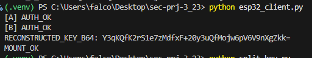

# SEC-PRJ-3_23 — Federated File System Encoding at the Edge in Smart Cities (MCU-based)

## Project Description
This project implements a proof-of-concept for a **federated secure filesystem** at the edge.  
The key idea: **an edge device cannot access its own secure data immediately after boot**.  
It must first authenticate with **multiple federated gateways**, collect decryption shares, and only then is able to mount its secure partition.

This simulates **Smart City** scenarios, where devices (e.g., ESP32 or Raspberry Pi class MCUs) depend on trusted gateways in the local network to unlock their encrypted storage.  
The design increases resilience: no single node can decrypt the data alone.

> **MCU note:** The repo contains **two clients**: a full PC client (`device/device.py`) that actually decrypts/mounts the secure file, and a **lightweight MCU-style client** (`esp32_client.py`) that authenticates to gateways, reconstructs the key, and signals `MOUNT_OK`. The MCU client is written in a MicroPython-friendly style (swap `requests` → `urequests` on real ESP32).

---

## Features
- **AES-256-GCM encryption** for data-at-rest (secure file `device/secure_data.enc`).
- **Federated authorization**: device must contact **two gateways (A & B)** to unlock data.
- **Key sharing (2-of-2)**: master key is split via XOR into two independent shares (A, B). Each gateway holds one share; **no single gateway can recover the key**.
- **Two device clients**:
  - **PC client** — `device/device.py`: gets both shares, reconstructs the key, **decrypts** and effectively “mounts” the secure partition (prints plaintext).
  - **MCU prototype** — `esp32_client.py`: authenticates to A & B, reconstructs the key, and prints `MOUNT_OK` (no heavy crypto/mount on-device). MicroPython-ready (on ESP32 replace `requests` with `urequests`).
- **Security**:
  - Requests authenticated with **HMAC** (`HMAC_SECRET` shared between device and gateways).
  - **Allowed-list** of device IDs on gateways (`ALLOWED_DEVICES`).
  - (Optional) **anti-replay window** using timestamp `ts` checked on the gateway.
- **Monitoring**: live events (`BOOT_LOCKED`, `AUTH_OK`, `MOUNT_OK/FAIL`) sent to **Telegram** from gateways.

---

## Project Structure

* [device](./device)  
  * [device.py](./device/device.py)  
  * [provision.py](./device/provision.py)  
  * [.env](./device/.env)  
* [gateway_a](./gateway_a)  
  * [app.py](./gateway_a/app.py)  
  * [.env](./gateway_a/.env)  
* [gateway_b](./gateway_b)  
  * [app.py](./gateway_b/app.py)  
  * [.env](./gateway_b/.env)  
* [split_key.py](./split_key.py)
* [esp32_client.py](./esp32_client.py)    
* [README.md](./README.md)

---

## How it Works
1. **Provisioning**  
   - A random AES-256 key is generated and stored in `device/.env` (`DEVICE_KEY_B64`).  
   - This key is used to encrypt `secure_data.enc` with AES-256-GCM.  
   - Handled by `device/provision.py`.  

2. **Key Sharing**  
   - The master key is split into two independent shares (XOR split).  
   - Share A → Gateway A, Share B → Gateway B.  
   - Handled by `split_key.py`.  

3. **Boot & Authorization**  
   - Device powers on with partition locked.  
   - **PC client (`device/device.py`)**: sends `BOOT_LOCKED` event to both gateways.  
   - **MCU client (`esp32_client.py`)**: directly requests authorization.  
   - Both clients call `/authorize` on Gateway A and B with `{dev_id, ts, sig}` signed via HMAC.  
   - Gateways verify the request (device ID in allow-list, signature valid) and each returns its share.  

4. **Federation Unlock**  
   - Both clients reconstruct the master key via `A XOR B`.  
   - **PC client**: uses the reconstructed key to decrypt `secure_data.enc` (AES-256-GCM) and prints the plaintext (simulated “mount”).  
   - **MCU client**: prints the reconstructed key and signals `MOUNT_OK` (without doing heavy AES-GCM on the microcontroller).  
   - Gateways log the status (`AUTH_OK`, `MOUNT_OK/FAIL`) and optionally push events to Telegram.  

---

## Screenshots

**1. Running gateways**  

**2. Running MCU prototype (esp32_client.py)**  

**3. Running device (full PC client)**  

**4. Telegram alerts from both gateways**  

---

## Goals & Relevance
- Demonstrates how **federated trust** can protect edge devices in **Smart City** scenarios.  
- Ensures that **no single gateway can unlock encrypted storage** → higher resilience and security.  
- Bridges concepts of **IoT security, distributed key management, and real-time monitoring**.  
- Lightweight implementation (Python + FastAPI) with both a **full PC client** and a **MicroPython-style MCU prototype** (ESP32 simulation), so no extra hardware is strictly required.  

---

## Status
- ✅ AES-256-GCM secure file generated and decrypted successfully.  
- ✅ XOR-based 2-of-2 key split across Gateway A and Gateway B.  
- ✅ End-to-end federation flow tested with **PC client (`device.py`)**.  
- ✅ **MCU prototype (`esp32_client.py`)** implemented and verified.  
- ✅ Telegram notifications integrated for live events.  
- 🔜 Planned extensions: Shamir’s Secret Sharing (K-of-N), Dockerized deployment, and direct ESP32 hardware port.  

---

## Credits
- **Zhalgas Abylkassymov** — University of Messina  
- Project Code: **SEC-PRJ-3_23**
