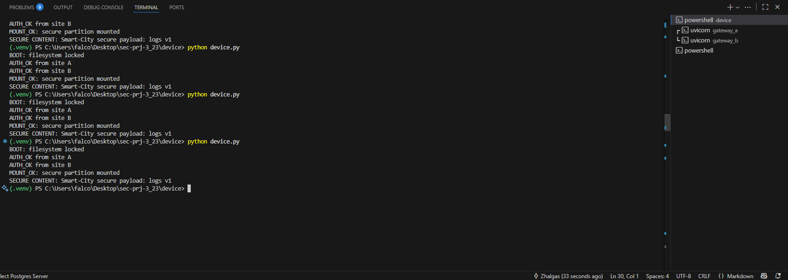

# SEC-PRJ-3_23 — Federated File System Encoding at the Edge in Smart Cities (MCU-based)

## Project Description
This project implements a proof-of-concept for a **federated secure filesystem** at the edge.  
The key idea: **an edge device cannot access its own secure data immediately after boot**.  
It must first authenticate with **multiple federated gateways**, collect decryption shares, and only then is able to mount its secure partition.  

This simulates **Smart City** scenarios, where devices (e.g., ESP32 or Raspberry Pi class MCUs) depend on trusted gateways in the local network to unlock their encrypted storage.  
The design increases resilience: no single node can decrypt the data alone.

---

## Features
- **AES-256-GCM encryption** for data-at-rest (secure file `secure_data.enc`).  
- **Federated authorization**: device must contact **two gateways (A & B)** to unlock data.  
- **Key sharing**: master key is split into 2 parts (XOR split). Each gateway holds one share.  
- **Edge device lifecycle**:
  - Boots with partition locked.
  - Requests authorization from gateways.
  - Collects both shares, reconstructs master key.
  - Mounts and decrypts secure partition.  
- **Security**:
  - Requests are authenticated with HMAC.
  - Only allowed devices can receive shares.
- **Monitoring**: live events (BOOT_LOCKED, AUTH_OK, MOUNT_OK/FAIL) are sent to **Telegram**.

---

## Project Structure

* [device](./device)  
  * [device.py](./device/device.py)  
  * [provision.py](./device/provision.py)  
  * [.env](./device/.env)  
* [gateway_a](./gateway_a)  
  * [app.py](./gateway_a/app.py)  
  * [.env](./gateway_a/.env)  
* [gateway_b](./gateway_b)  
  * [app.py](./gateway_b/app.py)  
  * [.env](./gateway_b/.env)  
* [split_key.py](./split_key.py)  
* [README.md](./README.md)

---

## How it Works
1. **Provisioning**  
   A random AES-256 key is generated and used to encrypt `secure_data.enc`.  
   (`provision.py` handles this step.)  

2. **Key Sharing**  
   The master key is split into two independent shares.  
   (`split_key.py` creates Share A and Share B for the gateways.)  

3. **Boot Process**  
   - Device starts locked (`device.py`).  
   - Sends authorization requests to Gateway A and Gateway B.  
   - Each gateway verifies the device ID and HMAC, and returns its share.  

4. **Federation Unlock**  
   - Device reconstructs the master key from the two shares.  
   - Secure partition is decrypted and mounted.  
   - Events are logged and pushed to Telegram.  

---

## Screenshots

**1. Running gateways** 

**2. Running device**  

**3. Telegram alerts from both gateways**  

---

## Goals & Relevance
- Demonstrates how **federated trust** can secure edge devices in **Smart Cities**.  
- Shows that **no single gateway can unlock data alone** → higher resilience and security.  
- Bridges concepts of **IoT security, distributed key management, and live monitoring**.  
- Implementation is lightweight (Python + FastAPI) and simulates ESP32/Raspberry devices without extra hardware.  

---

## Status
- ✅ AES-256-GCM secure file created and mounted.  
- ✅ XOR-based key split across two gateways.  
- ✅ Device federation flow implemented and tested.  
- ✅ Telegram notifications integrated.  
- 🔜 Extensions: Shamir’s Secret Sharing (K-of-N), Docker deployment, ESP32 port.  

---

## Credits
- **Zhalgas Abylkassymov** — University of Messina  
- Project Code: **SEC-PRJ-3_23**
